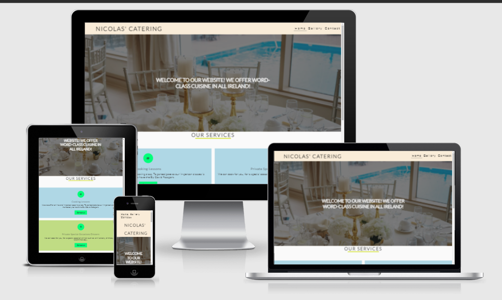
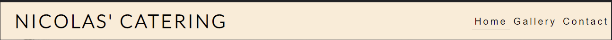
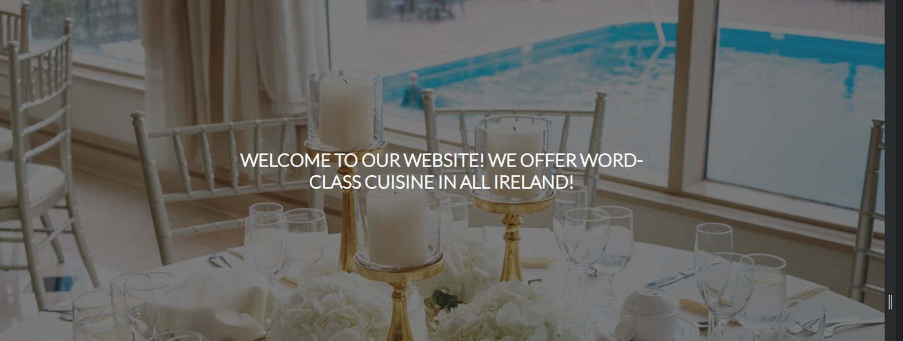
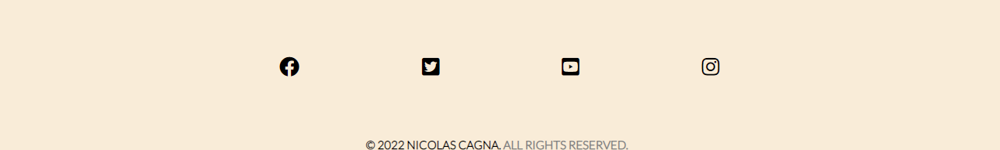
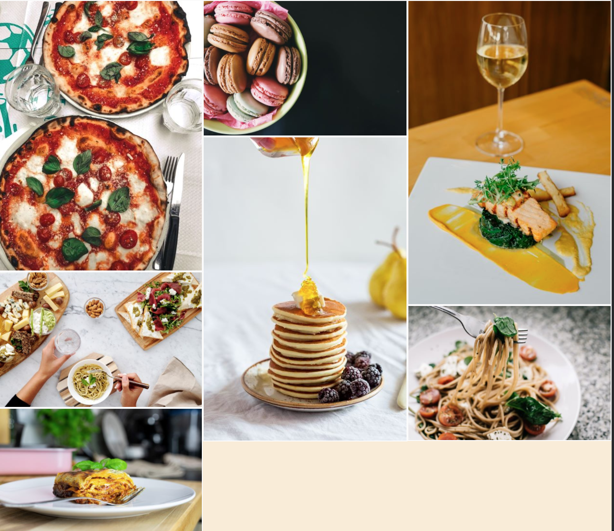
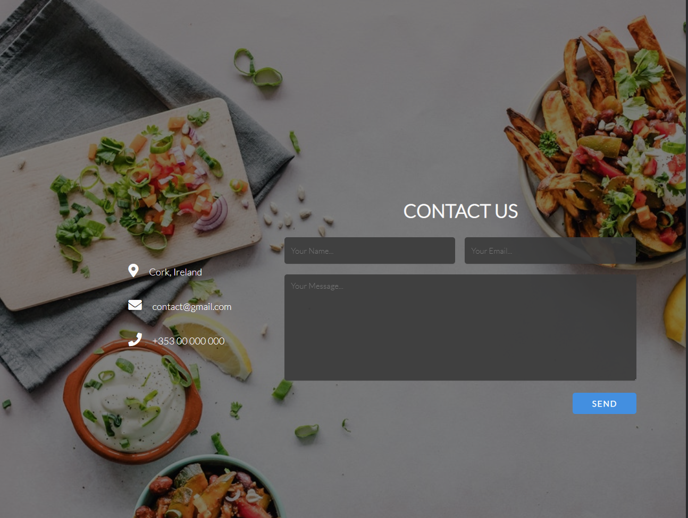
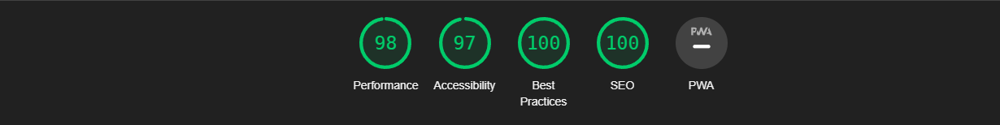

# Nicolas' Catering

This is the Nicolas' Catering website. The website is designed to be responsive for a large range of devices. The website have the purpose to reach people who love the idea to have great food in their home.

# Features
- Responsive on all device sizes.
- Interactive elements.

## Existing Features
- Navigation Bar:
   - The navigation bar is present in all the three pages. It includes the links to the Home page, Gallery and Contact pages. And it shows the name in the left corner: Nicolas's Catering, that links to the Home page.
   - The navigation bar allows users to easily navigate from page to page across all the type of devices.
   - The navigation bar is easy to read and accessible for all the users.
   

  

- The hero-image and text.
  - The hero-text summarize what is the service provide and what information the users can find in the website.
 

-Service section.
  * This section explains to the users all the services provided by Nicolas's catering.
  - I used also icons to make this section more colourfull and catchy.
  - The users will find the contact us button, this will bring the users to the contact page.

- The Footer.
  - The footer section includes the links for my social media profiles. The links will open in a new tab of the browser, this creates a better experience to the users.

- Gallery.
  - The gallery page allows the users to see my plates. 
  - The images are very catchy, and they help to increase the bookings.

  

- Contact.
    - The contact page allows users to contact us, in order to receive an answer to their doubts and questions and to book one of the services.
    - Users can also find email address, mobile number and address.

    

#  Technologies Used

## Language Used 

- HTML5
- CSS3

## Frameworks, Libraries & Programs Used

- Git:
  - Gitpod terminal was used to write the code and to commit to Git and Push to GithHub.
 - GitHub:
   - I used GitHub to store the project code after it has been pushed from Git.
- Google Fonts:
  - Google Fonts was used to import "Open Sans" font into the style.css file. This font has been used in all the pages of the ptoject.
- Font Awesome:
  - I used Font Awsome to add the social media icons in the footer section and for the "Our Services" section.

 ### Features Left to Implement
- Improve the gallery.
- Increase the services.

# Testing

###  Validator Testing
- HTML
    - No error were found when passing all the pages through the W3C Validator

- CSS
  - No error were found when passing all the pages through the Jigsaw validator

- Accessibility
  - I confirmed that the colors and fonts chosen are easy to read and understand by running it through the lighthouse in devtools.

  

## Unfixed Bugs

  No unfixed bugs.

## Deployment

- The site was deployed to GitHub pages. The steps to deploy are as follows:
    -   In the GitHub repository, navigate to the Settings tab
    -   From the source section drop-down menu, select the Master Branch
    -   Once the master branch has been selected, the page will be automatically refreshed with a detailed ribbon display to indicate the successful deployment.

The live link can be found here - https://nicolascagna96.github.io/catering-first-project/

# Credits

### Contents
- The code to make the navigation bar and the social media links was inspired by the CI Love Running Project.
- The code to make the Conatct Form was taken by a youtube tutorial video: https://www.youtube.com/watch?v=8kTPtrz7PiU&t=799s

### Media
- The image were all taken from Pexels.com
